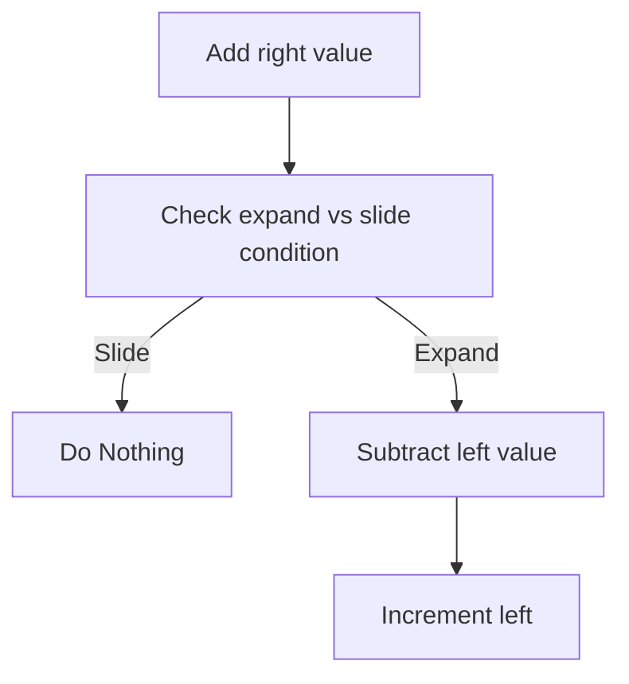

# Coding Problems

<span style="font-size: 1.5em;"><b>LeetCode Style Questions</b></span>

Created:  31 May 2024

## General Approaches
---
### Sorting

#### When to use
- If you have to add numbers to reach a target number
    - ie. how many ways can you add two numbers in this list to equal x

### Sliding Window
<span style="font-size: 20px;"><b>Examples</b></span>
> [Find longest string of 1s after deleting a single element](https://leetcode.com/problems/longest-subarray-of-1s-after-deleting-one-element/description/)
___

Use a sliding window when you're asked to find the maximum of something over an array using consecutive elements. Ie. the maximum consecutive string of 1s or the maximum average of consecutive elements.

#### Approach
1. Create left and right pointers at 0
2. While right < length loop
	1. Add right value
	2. Check slide vs expand condition
	3. If slide:
		1. subtract left value
		2. increment left pointer
	4. if expand:
		1. Do nothing (right is incremented in the loop)

<span style="font-size: 26px;">While right &lt; length:</span>



> [!tip] Distance between right and left
> Right will seem like it's one space too far to the right because for a window of size 3 the right pointer will be on the 4th space so to speak. This is fine, the flow of the code means that you'll have the correct number of elements calculated in the window.

### Prefix Sum

#### Notes
- Beware of the single space that exists at the start of a prefix sum, you may need to create a prefix sum array that is one longer than the underlying array to deal with this.
- Giving this pattern:
```java
prefix[0] = 0;
for (int i = 0; i < nums.length; i++){
	prefix[i + 1] = prefix[i] + nums[i];
	}
```


> [!NOTE] Prefix and Suffix code in Java
> ```java
> suffix[nums.length] = 0;
> for (int i = nums.length - 1; i > -1; i--){
> 	suffix[i] = suffix[i + 1] + nums[i];
> 	}
> 
> prefix[0] = 0;
> for (int i = 0; i < nums.length; i++){
> 	prefix[i + 1] = prefix[i] + nums[i];
> }
> ```

##### Calculate difference between two points
Prefix sums can be easily used to calculate any range of summation. They are not only useful in calculating the sum from the start of the iterable.

| elem       | a   | b   | c     | d     |
| ---------- | --- | --- | ----- | ----- |
| prefix sum | a   | a+b | a+b+c | a+b+c+d |

Now if you want to find **just c+d** you can do:
prefixSum[d] - prefixSum[b] &rarr; c+d

##### Prefix Sums and Maps/Dictionaries
If you have a target sum of consecutive elements that you're trying to find, you can use a prefix sum and a dictionary/map to see if the numbers exist in O(1) time.

1. At each point in the iterable put a pair in the dictionary of `{thisPrefixSum: frequency + 1}`
2. At each point check to see if there exists in the dictionary `thisPrefixSum - targetSum`
3. If so there are n consecutive elements that add to targetSum ending at the current element, where n is the frequency associated with `thisPrefixSum - targetSum` in the dictionary.

Look at the [Java response to this question](https://leetcode.com/problems/path-sum-iii/) for an example

### Stack

#### When to use
- When you have to process a linked list in reverse (iterate over it adding to stack and then pop from the top of the stack)
- When you have to move through an iterable and update it in some way that is not immediate (ie. you have to remember what to do when you encounter later elements)

### Binary Trees
#### General Recursive Approach
- Pass down information that gives **lower** nodes the required info
- Pass up success or failure information
- Store global information above the recursive function. Have the recursive function return void and simply update the global variable in the function.
```java
int result;

public void recurse(TreeNode root, int params){
	if (root == null) return;
	// update result here
}
```

#### Avoid making copies when passing down
The naive approach to passing down information that is unique to each node is to make a copy of the information (for example an array containing all of a node's parents).
This uses a lot of memory.
A better way of doing it is to backtrack, whereby you add the node's information to the data structure (ie. the array), do all the stuff you need within the recursive call and just before you pass the success or failure information up to the parent you remove the node's information from the data structure:

```java
public int recurse(root, info){
// base case
// add root to info
// check children
// set return value
// **remove root from info**
// return 
}

```

### Depth First Search (DFS)

> [!NOTE] DFS is recursive
> DFS is a natural fit with recursion. You can do it with a stack but it's less intuitive (for me).
#### When to Use


### Breadth First Search (BFS)
You'll want to use a queue here.

#### When to Use
- When you need to perform actions over a single level of a tree.

A way of keeping track of the depth is by setting an integer equal to the value of the size of the queue before you start popping and then pop exactly that many times, pushing as you go.
This means you'll just hit the current level within that loop.


```java
Queue<TreeNode> q = new LinkedList<>();
        int thisDepth = 1;
        q.add(root);
        while (q.size() > 0){
            int rowSize = q.size();
            System.out.println();
            System.out.println(thisDepth);
            while (rowSize > 0){
                TreeNode node = q.remove();
                System.out.println(node.val);
                if (node.left != null) q.add(node.left);
                if (node.right != null) q.add(node.right);
                rowSize--;
            }
            thisDepth++;
        }
```

### Binary Search
```java
class Solution {
    public int search(int[] nums, int target) {
        int l=0;
        int h=nums.length-1;
        while(l<=h){
            int mid = (l+h)/2;
            if(nums[mid]==target){
                return mid;
            }
            if(nums[mid]>target){
                h = mid-1;
            }else{
                l = mid+1;
            }
        }
        return -1;
    }
}
```

### Find Certain Sequence in Array (Greedy)
<span style="font-size: 20px;"><b>Examples</b></span>
> - Find maximum water container
> - Optimal buy and sell stock times
> - [Find increasing triplet in array](https://leetcode.com/problems/increasing-triplet-subsequence)

Here you want to use some number of pointers (actually is one quite often) and do a greedy search over the array.

**For buying and selling stocks you:**
1. Iterate over the array with a single pointer
2. On each price
	- Update minimum buy if it's the lowest yet seen
	- Update maxProfit if it has the greatest distance from the current minimum

Here minimum and maxProfit may not be taken from same points but min will always point to the best current buy point and maxProfit will be the maxProfit until the current point. 


**For finding increasing triplet**
1. Set min and mid to infinity
1. Iterate over the array with a single pointer
2. On each element
	- If its higher than mid return true
	- If its lower than min, update min
	- If its higher than min but lower than mid, update mid

This will keep a min and a mid that are not necessarily "in order" but are always the optimal min and mid to keep track of (ie the lowest)

**For finding the maximum amount of water** 
- Save the max yet found on each go
- Move left pointer if its lower than the right
- Move the right pointer if it's lower than the left
- Stop when the pointers meet
___


## Individual Approaches
---
### Three Pointers
Contain three adjacent pointers in java like this (setting l and r to 0 when they're not in the array):
```java
for (int i =  0; i < m; ++i) {
	int l = i ==  0 ?  0 : flowerbed[i -  1];
	int r = i == m -  1 ?  0 : flowerbed[i +  1];
	}
```

### Find number of complementary pair elements
- ie. how many pairs of numbers are there that add to a given k

- Create a frequency dictionary as you iterate to store all the numbers you find
- Check on each number to see if its complement is already in the dictionary, if so, decrement the complement in the dictionary, do not add the current element and increment the count

### Frequency Dictionaries
- Use an array as a frequency dictionary if you know the set of keys is small (ie. 26 length array for lower case letters)
- Work out how to do this in java

### Repeating array processing ([Dota Senate](https://leetcode.com/problems/number-of-recent-calls))
- Make queues with the indexes of both sides
- Pop both of the first senators
- Take the one with the lowest index (ie. furthest to the left) and add it to the end of it's own queue [i + senators.length()]
- continue until one of the queues is empty


## Algorithms
---

## Data Structures
---

### Linked List
#### Reverse a Linked List
Ok this is super easy and you've just gotta remember the steps.
For the sake of syntax think of this as the nodes staying in the same place but you're making the connections go from left&rarr;right to right&rarr;left
<span style="font-size: 26px;">The Steps:</span>
1. Define a new node that will be used to store the node to the left of the one you're dealing with. Set this to null
2. Iterate over the Linked List and at each point follow these steps:
	1. Save the node to the right in memory
	2. Update the outgoing link from the current node
	3. Save the current node as the left node for the next iteration
	4. Move the current node along to the right
3. Return the left node once you run off the right hand side

Thats:
1. Save right
2. Update link
3. Save current as left
4. Move to the right

```java
public ListNode reverseList(ListNode head) {
	ListNode leftNode = null;
	while (head != null){
		// save right
		ListNode rightNode = head.next;
		// reverse link
		head.next = leftNode;
		// save current for next iteration
		leftNode = head;
		// move to right
		head = rightNode;
	}
	return leftNode;
}
```

					   